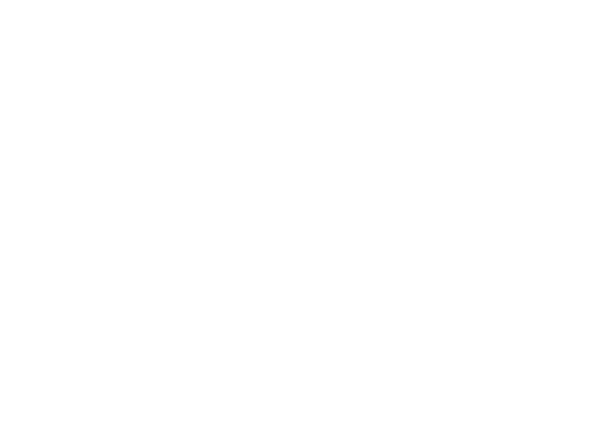
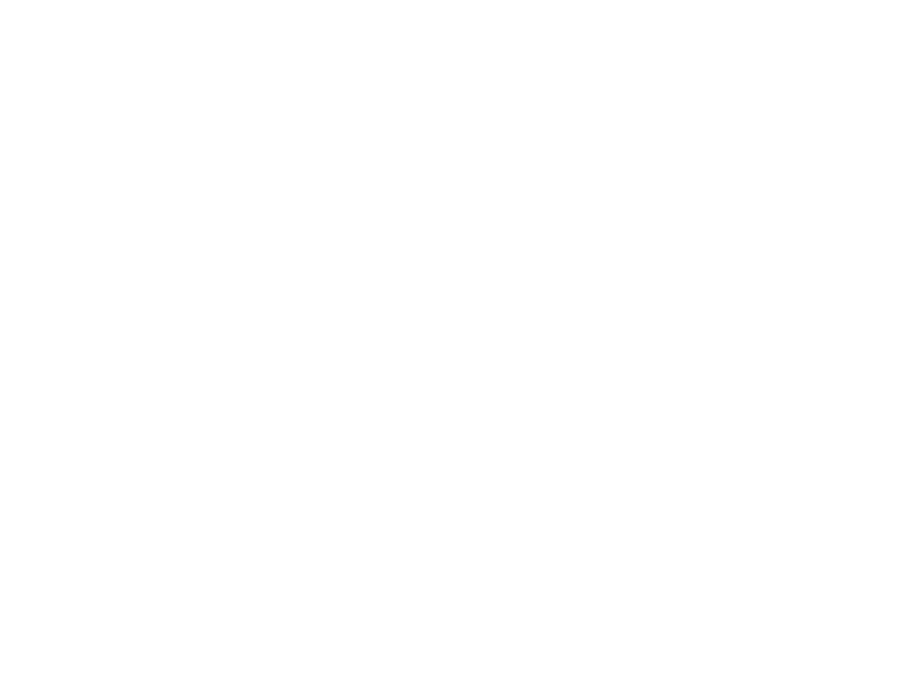
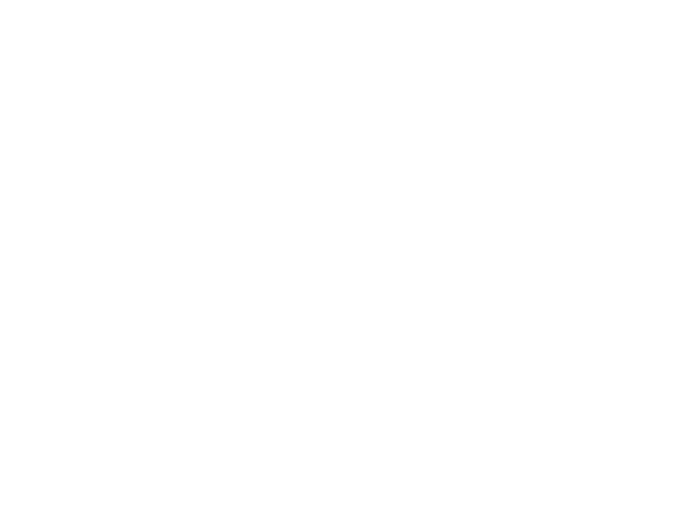

# Football Possession Value

### Data-Driven Tactical Analysis & Recruitment Decision Modelling

A football analytics project that models **possession value, player
impact, tactical team styles, and recruitment decisions** using event
data.

The project implements modern football analytics concepts such as
**Expected Threat (xT)** and **VAEP-style action valuation**, and
extends them into a **recruitment decision framework including tactical
fit modelling, squad optimisation and uncertainty simulation**.

------------------------------------------------------------------------

# Project Overview

Traditional football statistics such as **goals and assists** fail to
capture the value of actions earlier in attacking sequences.

Examples include:

-   progressive passes breaking defensive lines\
-   carries into the final third\
-   cutbacks before shots

These actions significantly increase the probability of scoring.

This project builds a **data-driven framework that assigns value to each
on-ball action and aggregates these values to measure player impact,
tactical profiles and recruitment potential**.

------------------------------------------------------------------------

# Analytics Pipeline

    StatsBomb event data
            │
            ▼
    Event preprocessing
            │
            ▼
    Expected Threat (xT)
            │
            ▼
    VAEP action valuation
            │
            ▼
    Player value model
            │
            ▼
    Team tactical profiling
            │
            ▼
    Player tactical segmentation
            │
            ▼
    Player-team fit modelling
            │
            ▼
    Recruitment shortlist
            │
            ▼
    Budget-constrained squad optimisation
            │
            ▼
    Robust recruitment simulation

------------------------------------------------------------------------

# Recruitment Optimisation

Example of an **optimised recruitment squad under budget constraints**.



Players are selected to maximise **squad value and tactical fit** while
satisfying:

-   transfer budget
-   role coverage
-   tactical compatibility

------------------------------------------------------------------------

# Optimisation Trade-Off

Optimisation balances **player quality vs cost efficiency**.



The MILP solver selects the combination of players that **maximises
total squad value while remaining under the budget constraint**.

------------------------------------------------------------------------

# Robust Recruitment Simulation

Recruitment decisions involve uncertainty in:

-   player performance
-   tactical fit
-   transfer costs

Monte Carlo simulation evaluates the robustness of recruitment
decisions.

## Distribution of Squad Value


## Distribution of Squad Cost



------------------------------------------------------------------------

# Methodology

### Expected Threat (xT)

Spatial model assigning value to pitch zones.

ΔxT = xT(destination) − xT(origin)

Captures **ball progression value**.

------------------------------------------------------------------------

### VAEP-Style Action Valuation

Machine learning model estimating:

-   probability of scoring
-   probability of conceding

Value(action) = ΔP(score) − ΔP(concede)

------------------------------------------------------------------------

### Player Value Modelling

Action values are aggregated to compute:

-   value added per 90
-   progression contribution
-   creative impact
-   turnover cost

These metrics identify players generating **real attacking value beyond
traditional stats**.

------------------------------------------------------------------------

### Tactical Team Profiling

Teams are characterised using event distributions such as:

-   possession structure
-   progressive carries
-   final-third actions

Unsupervised clustering identifies **tactical archetypes across teams**.

------------------------------------------------------------------------

### Player Tactical Segmentation

Players are grouped into roles such as:

-   elite creator
-   efficient creator
-   progression specialist
-   balanced contributor

This enables **role-aware recruitment modelling**.

------------------------------------------------------------------------

### Player-Team Fit

Similarity between:

-   player tactical vectors
-   team tactical profiles

Produces a **fit score estimating tactical compatibility**.

------------------------------------------------------------------------

# Project Structure

```bash
    football-possession-value
    │
    ├── config
    ├── data
    │   ├── raw
    │   └── processed
    ├── db
    ├── notebooks
    │   ├── 01_data_ingestion.ipynb
    │   ├── 02_event_model.ipynb
    │   ├── 03_xT_model.ipynb
    │   ├── 04_vaep_training.ipynb
    │   ├── 05_player_value_analysis.ipynb
    │   ├── 06_team_tactical_style.ipynb
    │   ├── 07_player_role_fit.ipynb
    │   ├── 08_recruitment_case_study.ipynb
    │   ├── 09_budget_constrained_optimisation.ipynb
    │   └── 10_robust_recruitment_simulation.ipynb
    ├── src
    ├── docs
    ├── reports
    │   └── figures
    ├── README.md
    ├── requirements.txt
    └── LICENSE
```

------------------------------------------------------------------------

# How To Run

Install dependencies

    pip install -r requirements.txt

Run notebooks sequentially

    01 → 02 → 03 → … → 10

------------------------------------------------------------------------

# Tech Stack

Python ecosystem:

-   pandas\
-   numpy\
-   duckdb\
-   scikit-learn\
-   LightGBM\
-   pyarrow\
-   pulp

Football analytics libraries:

-   statsbombpy\
-   mplsoccer

Visualisation:

-   matplotlib\
-   seaborn

------------------------------------------------------------------------

# License

MIT License

------------------------------------------------------------------------

# Author

Manuel Pérez Bañuls\
Data Science --- Football Analytics
